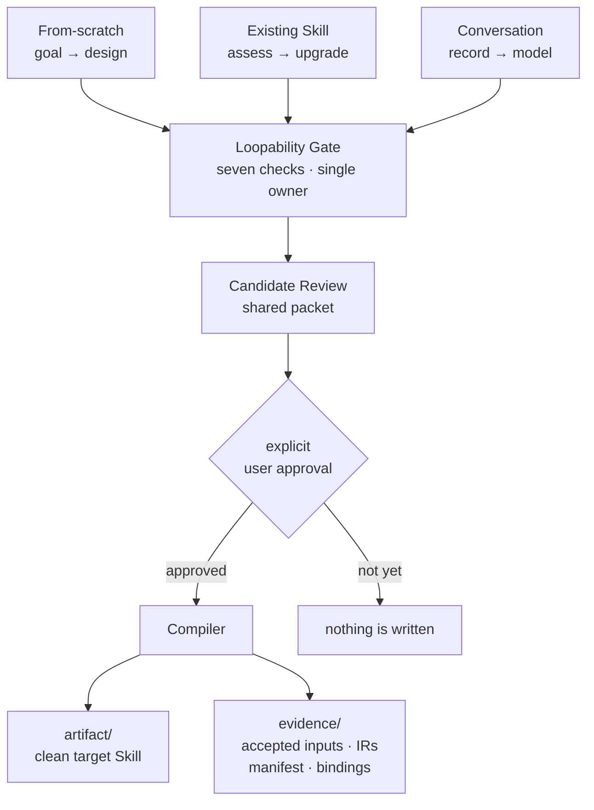

# Loop Craft

> Turn a goal, an existing Skill, or an authorized work record into an accepted behavior
> contract — then compile it deterministically into a clean installable Skill plus a separate,
> inspectable Evidence Package.

[中文版](README.zh.md) · [Design](docs/DESIGN.md) · [Evaluation](docs/REAL_WORLD_EVALUATION.md) · [Contributing](CONTRIBUTING.md)

---

## The problem

Agent workflows that are supposed to *iterate* — draft, check, revise, stop — get written as
flat prompts. Two failure modes show up over and over:

**Manufactured loops.** A fixed staged checklist gets called a loop because it has several
steps. Nothing in it consumes feedback, so a second pass changes nothing. The word "loop" is
doing no work.

**Unfalsifiable loops.** A real cycle exists, but its acceptance rule is *until it looks good*.
Nobody can reproduce the judgement. The loop either never terminates or terminates on model
self-confidence — and an error gets reported as success.

Both produce something that reads fine and behaves badly. Neither is caught by review, because
what's missing is not in the text: it's the absent verifier, the absent stopping rule, and the
absent record of why anyone accepted it.

Loop Craft's position: **a loop is a feedback system with terminal states, not a license for
autonomy.** If fresh feedback cannot change the next action, the honest answer is "this is a
workflow" — and the tool says so instead of manufacturing a cycle.

## How it works



Three entries recover a candidate contract from different sources. Everything after that is
shared: one Gate, one Review packet, one approval boundary, one deterministic build.

### The architectural decision that matters

The system is split at a hard line: **everything requiring judgement is pushed up into the
prompt layer; everything below the contract boundary is a pure function.**

| Layer | Contents | Verified by |
|---|---|---|
| Prompt | Routing, the Gate, Review, approval | Blind behavioral evaluation |
| Contract | JSON schemas — the only place a shape is defined | Schema meta-validation |
| Deterministic | validate → compile → adapter → evidence → pipeline | 160 unit/integration tests, byte comparison |

This is why the two layers **fail differently and must be verified differently**. A green test
suite says nothing about whether the Gate classifies correctly. A well-behaved interview says
nothing about whether two builds produce identical bytes. Both kinds of evidence are required;
neither substitutes for the other. Confusing the two is how a project ends up with 160 passing
tests and no evidence that the product works.

### Classification

| Qualifying Loops | Result |
|---|---|
| 0 | Ordinary Workflow — buildable, with steps, success evidence, and stop behavior |
| exactly 1 | Bounded Loop — buildable, with cycle, terminal states, and invariants |
| 2 or more | **Assessment only.** Independent Loops are never compressed to fit. |

The last row is a refusal, and it is deliberate. Compressing two independent feedback cycles
into one produces a Skill that silently drops half the behavior it promised.

## How it behaves with a user

Interaction design is a functional requirement here, not polish:

- **Nothing is written before explicit approval.** The Candidate Review is shown first. A
  generic "upgrade this" is not approval of a plan the user has not seen.
- **One question at a time, and only when it blocks.** A question must be unanswerable from
  the scoped evidence *and* prevent showing the Review. Everything else travels in the packet
  as `proposed` or `missing` and is settled by the approval decision.
- **The source wins over the paraphrase.** When a user's recollection conflicts with an
  unambiguous in-scope document, the tool follows the document, keeps going, and carries the
  discrepancy as an explicit note — instead of stalling on a question.
- **Unsupported means unsupported.** Multi-Loop, Runtime, publishing, scheduling: stated
  plainly, never approximated.

## Evidence

Behavioral evaluation across 27 blind cases, run in isolated sandboxes with the grading key
hidden from the agent under test. Full method and limitations:
[REAL_WORLD_EVALUATION.md](docs/REAL_WORLD_EVALUATION.md).

| Run | Cases | Pass | What changed before it |
|---|---|---|---|
| 1 | 24 | 18 | baseline |
| 2 | 24 | 20 | 8 rule-text edits |
| 3 | 27 | **25** | 3 tightening edits + 3 reverse guardrail cases |

Across all three runs: zero files written before approval (verified against the filesystem,
not the model's self-report) and the Skill under test never modified.

**One hard-fail, in run 3.** RV-003 filled the schema-required `authority` field with
plausible defaults — including a `git push` prohibition its source document never mentions —
and presented them as settled rather than as gaps. That is fabrication of a security
boundary, and it is the one failure in this evaluation that is over-reach rather than
under-delivery. It is unfixed, and it is the next thing being worked on. Details:
[REAL_WORLD_EVALUATION.md](docs/REAL_WORLD_EVALUATION.md).

Three findings worth stating plainly, because they shaped the work more than the pass rate did:

**Two failures were contradictions in the rule text, not model variance.** `embedded_loop` was
a verdict that could be reached but never built, because §4 produced it and §6's gate rejected
it. Re-running would never have helped.

**Enumerating prohibitions loses to paraphrase.** The first fix listed a forbidden flattening
argument. The model read it and constructed a rephrased exception. The fix that held inverted
the default: *the Loop count may only be reduced to 0 by a named failed check; any other route
to zero is not granted.*

**A relaxation you cannot falsify is not a fix.** The remaining repairs all made the tool stop
*less* often — and the dataset had no case whose correct answer was "stop". Three reverse cases
were written first. Two passed on first execution, demonstrating the tool already distinguishes
security boundaries and semantic loss from ordinary work. Only then was relaxation safe to
attempt.

## Current boundary

Supported: from-scratch design · existing-Skill assessment with source-preserving single-Loop
upgrade · authorized conversation distillation · zero-Loop and single-Loop packaging ·
manifest-bound Entry Evidence · deterministic build · read-only drift verification.

Not implemented: multi-Loop builds · Runtime · Override · Subloop · Compact Prompt output ·
Library Edition · publishing · scheduling · installation automation.

Known gaps with open remediation are tracked in
[risk-register.md](docs/project-management/risk-register.md) — including the two cases still
failing evaluation and why.

## Install

The runtime Skill is the [`loop-craft/`](loop-craft/) directory. Point your agent at this
repository, or copy that directory into the active Skill directory, then validate it with your
platform's Skill validator.

## Use

```text
Use $loop-craft to design a bounded feedback Loop from this goal.
Use $loop-craft to assess this existing Skill and decide whether a Loop belongs in it.
Use $loop-craft to distill this authorized conversation into a reusable Skill.
```

## Build and verify

Run from `loop-craft/` with Python 3.12+ and `jsonschema`:

```bash
python scripts/build_loop.py build <accepted-definition.json> <new-output-dir> --entry-evidence <approved-entry-evidence.json>
python scripts/build_loop.py verify <existing-output-dir>
```

`verify` is read-only. It reports `clean` (exit 0) or `drifted` (exit 1) and never repairs or
rebuilds. See [core-build.md](loop-craft/references/core-build.md) for the source-preserving
upgrade command.

On a non-UTF-8 locale, set `PYTHONUTF8=1` before running the official Skill validator —
generated Skills may contain non-ASCII text and the upstream validator reads files without an
explicit encoding.

## Output shape

```text
<output-dir>/
├── artifact/<skill-id>/     the clean target Skill — this is what ships
│   ├── SKILL.md
│   ├── agents/openai.yaml
│   └── references/final-execution-ir.json
└── evidence/                never ships with the artifact
    ├── accepted-definition.json      what was approved
    ├── final-execution-ir.json       what it compiled to
    ├── source-map.json               which field came from where
    ├── validation-report.json        what was checked
    ├── build-manifest.json           digests binding all of the above
    └── entry-evidence.json           why it was accepted, and by whom
```

The separation is the point. Raw conversations, private source material, development records,
and absolute local paths stay in `evidence/` and never enter the artifact — verified by
scanning generated packages for exactly those patterns.

Two independent bindings can appear in the manifest: **Source Package Evidence** proves which
source bytes were preserved; **Entry Evidence** records why the behavior was accepted. Neither
implies the other, and `verify` derives the expected file set from whichever are present.

## Repository map

```text
loop-craft/          the installable Skill — SKILL.md, references, Core scripts, schemas
docs/                DESIGN, evaluation, specs, plans, decision log, risk register
tests/               160 unit and integration tests
dashboard/           live project status (status.json + a static page)
.claude/agents/      stage-gate controller — independent quality and process review
```

Notable records: [Design](docs/DESIGN.md) ·
[Evaluation](docs/REAL_WORLD_EVALUATION.md) ·
[Decision log](docs/project-management/decision-log.md) ·
[Risk register](docs/project-management/risk-register.md)

## Reference boundaries

Loop Craft selectively localizes mechanisms from Loopy, Workflow Skill Creator, Skill Polisher,
Skill Creator Pro, and a set of skill-writing guidelines. Each is a **design reference**, not a
runtime dependency and not a vendored copy. What was adopted, what was excluded, and why is
recorded per source in
[resource-registry.yaml](docs/references/resource-registry.yaml) and summarised in
[NOTICE.md](NOTICE.md).

## License status

This repository has **not** yet selected a redistribution license. Absence of a `LICENSE` file
means all rights reserved by default — it is not an implicit grant. Treat it as development
material. Tracked as `R-014`.
