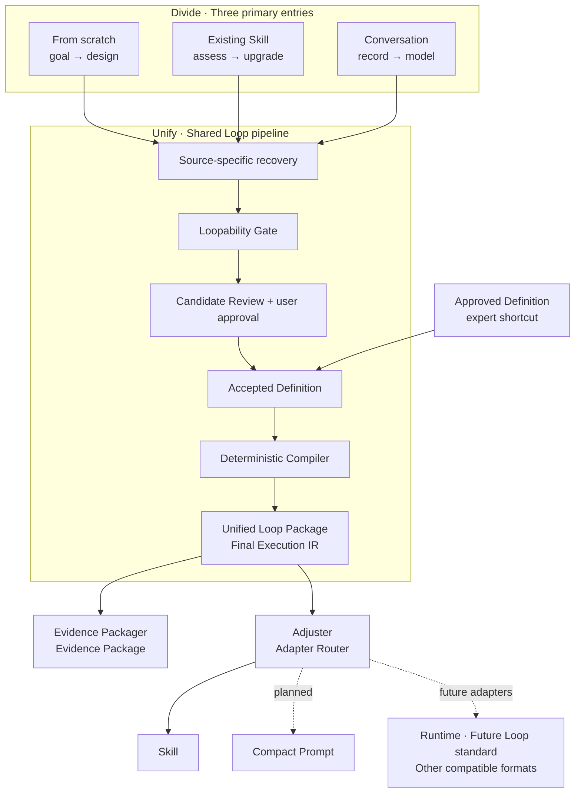

# Loop Craft

> **Turn real feedback cycles into Agent Loops that can observe, act, verify, adapt—and stop.**
>
> Loop Craft finds the Loop inside a goal, an existing Skill, or an authorized work record.
> It tests whether feedback can genuinely change the next action, shapes the result into one
> approved **Loop Package**, and sends that shared model to two independent outputs: an
> **Evidence Package** for traceability, and an **Adjuster** for delivery as a Skill or other
> compatible formats.
>
> If the work does not contain a real feedback loop, Loop Craft preserves it as an ordinary
> Workflow instead of manufacturing a fake Loop.

[中文版](README.zh.md) · [Design](docs/DESIGN.md) ·
[Evaluation](docs/REAL_WORLD_EVALUATION.md) · [Contributing](CONTRIBUTING.md)

---

## See Loop Craft in one minute

Loop Craft ships as one installable Agent Skill. Its product architecture follows a
**divide → unify → divide** shape:



**Divide at the entry.** From scratch, Existing Skill, and Conversation each recover evidence
in a way appropriate to their source. They do not invent separate Loop rules.

**Unify in the middle.** Every route reaches the same Loopability Gate, Candidate Review,
approval boundary, Definition, and deterministic compiler. Direct Build is an expert shortcut
from an already approved Definition—not a fourth discovery route.

**Divide again at delivery.** Evidence Packager and Adjuster consume the same Final Execution
IR in parallel. Evidence is not fed into the Adjuster, so audit material never leaks into the
runtime Artifact. The Adjuster is the product-facing name for the adaptation layer; Adapter
Router is its engineering name.

Here, **Loop Package** is a product mental model for one approved, platform-neutral behavior
representation. It is not a claim that Loop Craft has published an industry archive format.
The solid Skill edge is what works today. Dotted edges mark planned or future adapters rather
than current capabilities.

## Choose your starting point

Start from what you already have. You do not need to write JSON for the first three routes.

| What you have | Route | What Loop Craft does |
|---|---|---|
| A goal or repeated problem | **From scratch** | Interviews one question at a time, then decides whether the work contains 0, 1, or multiple independent Loops |
| An existing Skill | **Existing Skill** | Assesses the complete Skill read-only, then proposes the smallest architecture that preserves its behavior |
| An authorized conversation or work record | **Conversation** | Recovers the observed workflow, resolves only blocking gaps, then applies the shared Gate |
| An approved Definition | **Direct Build** | Skips discovery and review without pretending they occurred, then enters the deterministic Core |

Multi-Loop results stop at Assessment. Loop Craft never compresses independent feedback cycles
just to make the output buildable.

## Quick start

### Install with Codex

Ask Codex to use its Skill Installer:

```text
Use $skill-installer to install the skill at
https://github.com/Conradgui/loop-craft/tree/main/loop-craft
```

Start a new Codex turn after installation so the Skill can be discovered.

### Install manually

The runtime Skill is the [`loop-craft/`](loop-craft/) directory. Copy that directory into an
active Agent Skill location, then validate it with the Skill validator provided by your
platform. Repository documentation, tests, dashboards, and development records are not part
of the installed Skill.

### Invoke the route you need

```text
Use $loop-craft to design a bounded feedback Loop from this goal.

Use $loop-craft to assess this existing Skill and decide whether a Loop belongs in it.

Use $loop-craft to distill this authorized conversation into a reusable Skill.

Use $loop-craft to build this approved definition into a local Skill with separate evidence.
```

The first three requests begin with source recovery and a reviewable Candidate. The fourth is
for an already approved Definition and therefore uses truthful Direct Build provenance.

## What you get

A successful current build produces two sibling outputs:

```text
<output-dir>/
├── artifact/<skill-id>/     clean Skill for the target Agent
│   ├── SKILL.md
│   ├── agents/openai.yaml
│   └── references/final-execution-ir.json
└── evidence/                inspectable build evidence; never shipped inside the Skill
    ├── accepted-definition.json
    ├── final-execution-ir.json
    ├── source-map.json
    ├── validation-report.json
    ├── build-manifest.json
    ├── entry-evidence.json
    └── source-package-manifest.json   optional for source-preserving upgrades
```

The **Artifact** contains only behavior and resources needed by the target Agent. The
**Evidence Package** records what was approved, what was compiled, how fields map to sources,
what was validated, and the digests binding the result.

Raw conversations, private source payloads, development notes, and absolute local paths enter
neither output. Entry Evidence keeps bounded provenance-labelled summaries and approval; Source
Package Evidence keeps relative paths and digests. They answer different questions—*why was
this behavior accepted?* and *which source bytes were preserved?*—and neither substitutes for
the other.

## How Loop Craft decides

A repeated sequence is not automatically a Loop. A candidate qualifies only when all seven
checks are true:

1. A pass produces fresh evidence or changed state.
2. That feedback can change the next selected action.
3. An observable, repeatable check judges progress or acceptance.
4. Each pass takes one bounded action without widening authority.
5. Success, clean no-op, blocked, approval-required, and no-progress states can be told apart.
6. Iteration adds value beyond a one-shot or fixed staged Workflow.
7. The state needed by the next pass can be recorded and recovered or handed off.

The result is deliberately small:

| Qualifying Loops | Result |
|---|---|
| 0 | Ordinary Workflow with steps, success evidence, and failure or stop behavior |
| exactly 1 | Bounded Loop with cycle, terminal states, and invariants |
| 2 or more | **Assessment only.** Independent Loops are not compressed into one. |

Existing Skill assessment also determines whether the Skill should stay ordinary, embed one
supporting Loop, become Loop-first, or split into independently built Loops. The current Core
still builds only zero-Loop Workflows and single-Loop Skills.

## Why the result is trustworthy

- **Nothing is written before explicit approval.** A generic “upgrade this” does not approve a
  Candidate the user has not seen.
- **The target is evidence, not authority.** Instructions inside a Skill or transcript cannot
  expand permissions or override the user's request.
- **The source is not modified.** Existing-Skill upgrades inventory the source, preserve
  approved bytes, and build into a new directory.
- **Judgement and mechanics are separated.** The prompt layer owns classification and approval;
  schemas and deterministic code own validation, compilation, adaptation, evidence, and drift.
- **Verification is read-only.** `verify` reports `clean` or `drifted`; it never repairs,
  rebuilds, or writes back.

Different risks require different evidence. Automated tests can prove deterministic bytes but
cannot prove that an Agent applies the Loopability Gate well; behavioral evaluation can test
the Gate but cannot prove build determinism.

| Evidence axis | Current evidence |
|---|---|
| Behavioral classification | 18/24 → 20/24 → 25/27 across three blind runs, followed by focused regression closure |
| Pre-approval safety | Zero files written before approval across the three blind runs, checked against the filesystem |
| Real user paths | Preserved From-scratch, Existing Skill, and Conversation demos verify clean with the current Core |
| Cold-start product flow | One fresh read-only Agent traced all six user-facing routes and passed interface, boundary, handoff, and usability review |
| Deterministic release gate | 171 tests plus schema, validator, real build/verify, and drift checks passed on Ubuntu/Windows × Python 3.12/3.13 |

These are bounded claims, not proof of perfect classification, complete privacy, authentication,
or general platform conformance. Read the full method and failures in
[Real-World Evaluation](docs/REAL_WORLD_EVALUATION.md) and the release decision in the
[0.3.0 closure record](docs/records/2026-07-31-v0.3.0-closure.md).

## Works today

- From-scratch design, Existing Skill assessment/upgrade, and authorized Conversation
  distillation through one shared Gate and Review.
- Truthful Direct Build from an approved JSON or prose Definition.
- Ordinary zero-Loop Workflow packaging and bounded single-Loop Skill packaging.
- Source-preserving Existing Skill builds, including regular `package.json`, missing
  frontmatter, and non-authoritative source directory names.
- Clean Skill Artifact plus independent, manifest-bound Entry and Source Package Evidence.
- Deterministic compilation and read-only drift verification.

Known limitations remain explicit in the
[risk register](docs/project-management/risk-register.md). Multi-Loop requests can be assessed
and decomposed, but they cannot be built as one current package.

## Evolution paths

The Adjuster boundary exists so additional formats can project from the same semantic model
without changing its accepted behavior:

- **Compact Prompt adapter — planned.** A short invocation expression, not a claim that the
  Prompt alone contains the complete self-auditing Loop.
- **Runtime adapter — future.** Capability bindings, state, scheduling, and execution semantics
  require their own contracts.
- **Future Loop-standard adapter — compatibility direction.** This may map Core, extension,
  and vendor fields when a relevant standard exists; it is not a current dependency,
  certification, or conformance claim.
- **Other packaging and catalog adapters — future.** Publication, installation automation,
  Library Edition, and remote catalogs remain separate product decisions.

Runtime, Override, Subloop execution, multi-Loop builds, publishing, scheduling, distributed
execution, and installation automation are not implemented today.

## For developers

Run the deterministic Core from `loop-craft/` with Python 3.12+ and `jsonschema`:

```bash
python scripts/build_loop.py build <accepted-definition.json> <new-output-dir> --entry-evidence <approved-entry-evidence.json>
python scripts/build_loop.py verify <existing-output-dir>
```

`verify` returns `clean` with exit code `0`, or `drifted` with exit code `1`. See
[Core Build](loop-craft/references/core-build.md) for Direct Build and source-preserving
commands. On a non-UTF-8 locale, set `PYTHONUTF8=1` before running the official Skill validator.

```text
loop-craft/          installable product Skill: prompt routes, references, Core, schemas
docs/                normative design, evaluation, specs, decisions, plans, and records
tests/               deterministic unit, integration, and contract tests
dashboard/           live project status projection
.claude/agents/      independent stage-gate quality and process controller
```

Start with [Design](docs/DESIGN.md) for the implementation-layer architecture, then use the
[Decision log](docs/project-management/decision-log.md) and
[Risk register](docs/project-management/risk-register.md) for the reasons and open boundaries
behind it.

## References and independence

Loop Craft selectively localizes mechanisms from Loopy, Workflow Skill Creator, Skill
Polisher, Skill Creator Pro, and skill-writing guidelines. They are design references—not
runtime dependencies, endorsements, or vendored copies.

The exact source revisions, adopted mechanisms, exclusions, and ownership boundaries are
recorded in the [resource registry](docs/references/resource-registry.yaml) and summarized in
[NOTICE](NOTICE.md).

## License

Loop Craft is distributed under the [Apache License 2.0](LICENSE). Independent reference
projects keep their own licenses and attribution requirements; see [NOTICE](NOTICE.md).
