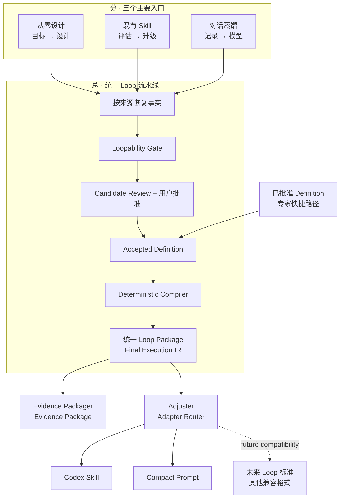

# Loop Craft

[](https://github.com/Conradgui/loop-craft/actions/workflows/validate.yml)
[](CHANGELOG.md)
[](pyproject.toml)
[](LICENSE)

> **把真正的反馈闭环，变成 Agent 能观察、行动、验证、调整并及时停止的 Loop。**
>
> Loop Craft 从目标、既有 Skill 或已授权的工作记录中识别真正的 Loop。它先判断反馈是否
> 确实能够改变下一步行动，再形成一份经过确认的统一 **Loop Package**，并将同一个模型分向
> 两个独立出口：**Evidence Package** 负责可追溯性，**Adjuster** 负责将其交付为完整 Skill
> 或可直接复制的 Compact Prompt。
>
> 如果工作中不存在真正的反馈闭环，Loop Craft 会把它保留为普通 Workflow，而不是为了
> “有 Loop”强行制造循环。

[English](README.md) · [架构设计](docs/DESIGN.md) ·
[评估证据](docs/REAL_WORLD_EVALUATION.md) · [参与开发](CONTRIBUTING.md)

---

## 一分钟看懂 Loop Craft

Loop Craft 本身是一个可安装的 Agent Skill。它的产品架构是一个清晰的
**分 → 总 → 分**结构：



**入口先分。** From scratch、Existing Skill 和 Conversation 面对的原始材料不同，所以各自
负责恢复来源事实；但它们不会各写一套 Loop 判断规则。

**中间汇总。** 三条路径进入同一个 Loopability Gate、Candidate Review、批准边界、Definition
和确定性 Compiler。Direct Build 只是让一份已经批准的 Definition 直接进入 Core 的专家快捷
路径，不是第四个发现入口。

**交付再分。** Evidence Packager 与 Adjuster 并列消费同一份 Final Execution IR。Evidence
不会先进入 Adjuster，因此审计材料不会混进运行时 Artifact。Adjuster 是面向用户的“适配层”
名称；Adapter Router 是对应的工程名称。

这里的 **Loop Package** 是“同一份经过批准、与平台无关的行为表示”这一产品心智模型，不是在
宣称 Loop Craft 已经发布了新的行业压缩包或标准格式。Skill 与 Compact Prompt 两条实线都是
当前能力；虚线只表示未来兼容方向，而不是当前合规声明。

## 选择你的起点

从你手里已经有的材料开始。前三条路径都不要求你先写 JSON。

| 你现在有 | 路径 | Loop Craft 会做什么 |
|---|---|---|
| 一个目标或反复发生的问题 | **From scratch** | 一次问一个问题，再判断其中有 0 个、1 个还是多个独立 Loop |
| 一个既有 Skill | **Existing Skill** | 先完整、只读地评估，再提出能保留现有行为的最小架构 |
| 一段已授权的对话或工作记录 | **Conversation** | 恢复实际发生的工作流，只澄清阻塞缺口，再进入共享 Gate |
| 一份已经批准的 Definition | **Direct Build** | 不重演、也不伪造发现与 Review，直接进入确定性 Core |

多 Loop 结果会停在 Assessment。Loop Craft 不会为了让结果“能构建”，把相互独立的反馈闭环
强行压成一个。

## 快速开始

### 使用 Codex 安装

让 Codex 调用它的 Skill Installer：

```text
使用 $skill-installer 安装这个地址中的 Skill：
https://github.com/Conradgui/loop-craft/tree/main/loop-craft
```

安装后开启一个新的 Codex 对话，让新 Skill 被重新发现。

### 手动安装

真正的运行时 Skill 是 [`loop-craft/`](loop-craft/) 目录。把这个目录复制到 Agent 当前生效的
Skill 位置，再用所在平台提供的 Skill validator 校验。仓库里的项目文档、测试、看板和开发
记录都不是安装包的一部分。

### 直接调用需要的路径

```text
使用 $loop-craft，从这个目标开始设计一个有界的反馈 Loop。

使用 $loop-craft，评估这个既有 Skill，并判断其中是否应该存在 Loop。

使用 $loop-craft，把这段已授权的对话蒸馏成一个可复用 Skill。

使用 $loop-craft，把这份已经批准的 Definition 构建成本地 Skill，并生成独立 Evidence。

使用 $loop-craft，把这份已经批准的 Definition 构建成 Compact Prompt，并生成独立 Evidence。
```

前三条请求会先恢复来源事实并给出可审阅 Candidate；第四条只适用于已经批准的 Definition，
因此使用如实记录来源的 Direct Build 路径。

## 你会得到什么

一次成功构建会选择一个 Adapter，并产出一个 Artifact 与一份独立 Evidence：

```text
<output-dir>/
├── artifact/<id>/           只包含本次选择的一种输出
│   ├── SKILL.md             Codex Skill 构建
│   ├── agents/openai.yaml
│   └── references/final-execution-ir.json
│          或
│   └── PROMPT.md            Compact Prompt 构建
└── evidence/                可查验的构建证据；与 Artifact 分开
    ├── accepted-definition.json
    ├── final-execution-ir.json
    ├── source-map.json
    ├── validation-report.json
    ├── build-manifest.json
    ├── entry-evidence.json             可选，绑定入口
    ├── native-validation.json          可选，仅 Codex Skill
    └── source-package-manifest.json   保源升级时可选
```

默认 `codex-skill` Adapter 生成完整 Skill，并在提供当前 Codex Validator 时绑定原生验证回执。
`compact-prompt` Adapter 把同一份已批准行为压缩成可直接复制的调用表达。它是
runtime-delegated：工具、状态和执行环境由接收 Prompt 的 Agent 提供，因此不会被夸大成 Runtime
或自带审计能力的完整包。

**Artifact** 只保留目标用途所需的行为与资源。**Evidence Package** 记录批准了什么、编译成了
什么、选择了哪个 Adapter、各字段来自哪里、检查了什么，以及把结果绑定起来的摘要。

原始对话、私有源材料、开发笔记和本机绝对路径都不会进入这两个输出。Entry Evidence 只保留
有 provenance 标签的有限摘要与批准；Source Package Evidence 只保留相对路径和摘要。前者回答
“为什么接受这个行为”，后者回答“保留了哪些源文件字节”，两者不能互相替代。

## Loop Craft 如何判断

一段工作会重复，不等于它就是 Loop。候选行为必须同时通过七项检查：

1. 每一轮都会产生新证据或改变状态；
2. 这些反馈确实能改变下一步选择；
3. 存在可观察、可重复的检查来判断进展或验收；
4. 每一轮只执行一个有界动作，不暗中扩大权限；
5. 能区分成功、干净 no-op、阻塞、等待批准和无进展；
6. 迭代比一次性动作或固定阶段式 Workflow 更有价值；
7. 下一轮需要的状态可以记录，并能恢复或交接。

分类结果刻意保持简单：

| 合格 Loop 数 | 结果 |
|---|---|
| 0 | 普通 Workflow，包含步骤、成功证据以及失败或停止行为 |
| 恰好 1 | 有界 Loop，包含 cycle、终止状态和 invariants |
| 2 个及以上 | **只产出 Assessment。** 独立 Loop 不会被压成一个。 |

评估既有 Skill 时，还会判断它应该继续保持普通 Skill、嵌入一个支持型 Loop、变成 Loop-first
Skill，还是拆成分别构建的独立 Loop。当前 Core 仍只构建 0 Loop Workflow 和单 Loop Skill。

## 为什么这个结果值得信任

- **明确批准之前不写文件。** 一句“帮我升级”不等于批准了用户还没有见过的 Candidate。
- **目标材料是证据，不是权限。** Skill 或对话里的指令不能扩大权限，也不能覆盖用户请求。
- **源包不会被修改。** Existing Skill 路径先盘点和审阅源包，再把批准的内容构建到新目录。
- **判断与机械执行分开。** 提示词层负责分类和批准；Schema 与确定性代码负责校验、编译、
  适配、Evidence 和 drift。
- **Verify 严格只读。** 它只返回 `clean` 或 `drifted`，从不修复、重建或写回。

不同风险需要不同证据。自动化测试能证明确定性字节，却不能证明 Agent 会正确使用 Gate；行为
评估可以检查 Gate，却不能替代构建确定性验证。

| 证据维度 | 当前证据 |
|---|---|
| 行为分类 | 三轮盲测从 18/24 → 20/24 → 25/27，随后完成定向回归关闭 |
| 批准前安全 | 三轮盲测均为批准前 0 文件写入，并以文件系统核对而非模型自述 |
| 真实用户路径 | 保留的 From-scratch、Existing Skill 和 Conversation Demo 均被当前 Core 验证为 clean |
| 冷启动产品流程 | 一个全新只读 Agent 追踪六条用户路径，接口、边界、衔接和可用性四项均通过 |
| 确定性发布出口 | 0.4.0 本地候选已通过 190 tests、compileall、当前 Codex 原生 Validator，以及 Skill/Prompt 两份真实 clean build；最终推送后再裁决远端矩阵 |

这些证据支持的是有边界的结论，不代表完美分类、完整隐私保护、身份认证或通用平台合规。
完整方法与历史失败见[真实世界评估](docs/REAL_WORLD_EVALUATION.md)，最终阶段判断见
[0.3.0 封板记录](docs/records/2026-07-31-v0.3.0-closure.md)。

## 当前可用

- From-scratch、Existing Skill 和已授权 Conversation 三个入口，共用一个 Gate 与 Review；
- 从已批准 JSON 或散文 Definition 进入的如实 Direct Build；
- 普通 0 Loop Workflow 和有界单 Loop Skill 打包；
- Existing Skill 保源构建，包括常见 `package.json`、缺失 frontmatter 和非权威源目录名；
- 同一 Final Execution IR 可选择确定性的 `codex-skill` 或 `compact-prompt` 输出；一次 build
  只生成一种 Artifact；
- Skill 构建可绑定当前 Codex 原生 Validator 回执，不在构建后直接修改产物；
- 干净 Artifact，以及独立、Manifest 绑定的 Entry、Source Package 与可选原生验证 Evidence；
- 确定性编译与只读 drift 校验。

已知限制继续记录在[风险登记](docs/project-management/risk-register.md)。多 Loop 请求可以被评估
和拆分，但当前不能作为一个包直接构建。

## 兼容方向

Adjuster 边界让未来格式可以从同一语义模型投影，而不修改已经批准的行为：

- **未来 Loop 标准 Adapter——兼容方向。** 当相关标准存在时，可以映射 Core、Extension 和
  Vendor 字段；当前不依赖该标准，也不声称认证或合规。
- **其他打包与 Catalog Adapter——未来方向。** 发布、安装自动化、Library Edition 和远程
  Catalog 仍是独立产品决策。

Runtime 不是当前 Adapter 后面缺失的一步，而是另一类执行产品，需要独立负责 Capability
Binding、状态、调度、权限和重试。Runtime、Override、Subloop 执行、多 Loop 构建、发布、调度、
分布式执行和安装自动化继续位于当前产品边界之外。

## 面向开发者

在 `loop-craft/` 下运行确定性 Core，需要 Python 3.12+ 与 `jsonschema`：

```bash
python scripts/build_loop.py build <accepted-definition.json> <new-output-dir> --adapter codex-skill --native-validator <current-quick-validate.py> --entry-evidence <approved-entry-evidence.json>
python scripts/build_loop.py build <accepted-definition.json> <new-output-dir> --adapter compact-prompt --entry-evidence <approved-entry-evidence.json>
python scripts/build_loop.py verify <existing-output-dir>
```

`verify` 返回 `clean`（退出码 `0`）或 `drifted`（退出码 `1`）。Direct Build 与保源构建命令见
[Core Build](loop-craft/references/core-build.md)。非 UTF-8 locale 运行官方 Skill validator 前，
请设置 `PYTHONUTF8=1`。

```text
loop-craft/          可安装的产品 Skill：入口提示词、references、Core 与 Schema
docs/                规范设计、评估、spec、决策、计划和执行记录
tests/               确定性单元、集成与合同测试
dashboard/           项目状态的实时投影
.claude/agents/      独立的阶段出口质量与过程管控 Agent
```

先读[架构设计](docs/DESIGN.md)理解内部实现分层，再通过
[决策日志](docs/project-management/decision-log.md)和
[风险登记](docs/project-management/risk-register.md)追溯设计理由与开放边界。

## 参考来源与独立性

Loop Craft 选择性地本地化了 Loopy、Workflow Skill Creator、Skill Polisher、Skill Creator Pro
和 Skill 写作指南中的机制。它们是设计参考，不是运行依赖、背书关系或代码内嵌复制。

每个来源的固定 revision、采纳机制、排除内容和所有权边界记录在
[资源登记](docs/references/resource-registry.yaml)，摘要见 [NOTICE](NOTICE.md)。

## 许可证

Loop Craft 按 [Apache License 2.0](LICENSE) 分发。独立参考项目继续适用各自的许可证与归属
要求，详见 [NOTICE](NOTICE.md)。
