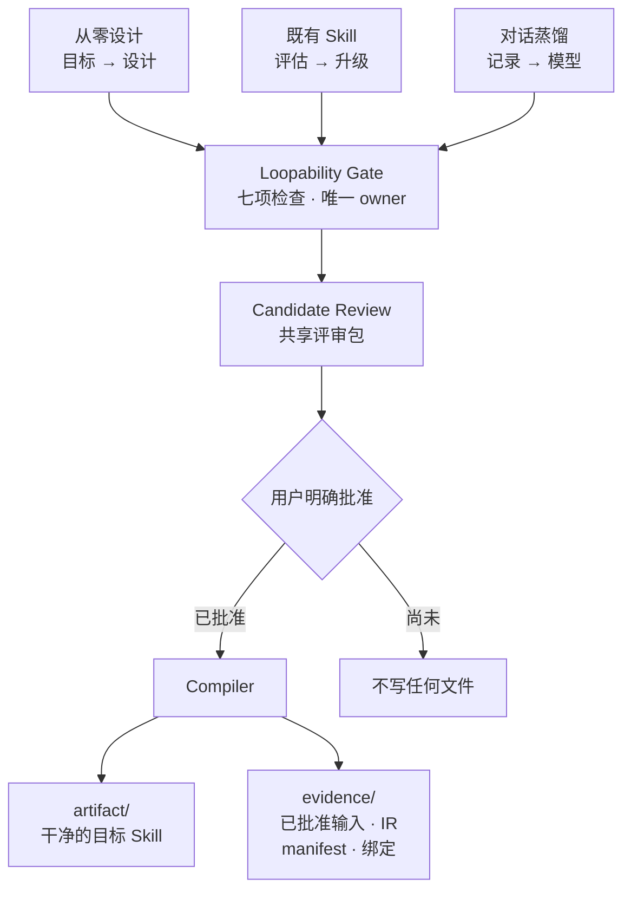

# Loop Craft

> 把一个目标、一个既有 Skill，或一段已授权的工作记录，转成一份**经过批准的行为契约**，
> 再确定性地编译成一个干净可安装的 Skill，以及一份独立、可查验的 Evidence Package。

[English](README.md) · [架构设计](docs/DESIGN.md) · [评估证据](docs/REAL_WORLD_EVALUATION.md) · [参与开发](CONTRIBUTING.md)

---

## 要解决的问题

本该**迭代**的 Agent 工作流——起草、检查、修订、停止——最后往往被写成一段平铺的 Prompt。
两种失效反复出现：

**伪造的循环。** 一份固定的阶段式清单，因为步骤多就被叫作"循环"。里面没有任何环节消费反馈，
跑第二遍和第一遍没有区别。"循环"这个词没有承担任何工作。

**无法证伪的循环。** 循环确实存在，但验收标准是"直到看起来不错"。没人能复现这个判断。
于是它要么永不终止，要么终止于模型的自我确信——而错误被当成成功上报。

两者写出来都很像样，跑起来都不行。评审也抓不住，因为**缺的东西不在文本里**：缺的是不存在的
验证器、不存在的停止规则，以及不存在的"当初凭什么接受它"的记录。

Loop Craft 的立场是：**循环是一个带终止状态的反馈系统，不是放开自主权的许可证。**
如果新反馈无法改变下一步动作，诚实的答案就是"这是一个 workflow"——工具会直说，而不是给你
造一个循环出来。

## 它怎么工作



三个入口从不同来源恢复候选契约。此后全部共享：一个 Gate、一个评审包、一道批准边界、
一条确定性构建链。

### 真正关键的那个架构决策

系统在一条硬线上被切开：**凡需要判断的一律上推到提示词层，契约边界以下全是纯函数。**

| 层 | 内容 | 验证手段 |
|---|---|---|
| 提示词层 | 路由、Gate、评审、批准 | 隔离盲测行为评估 |
| 契约层 | JSON schema——形状只在这里定义一次 | Schema 元校验 |
| 确定性层 | validate → compile → adapter → evidence → pipeline | 自动化合同测试 + 逐字节比对 |

这解释了为什么两层**失效方式不同，必须用不同手段验证**。一套全绿的测试对"Gate 分类是否正确"
一无所知；一次表现良好的访谈也无法说明两次构建是否产出相同字节。两类证据缺一不可，互不替代。

把这两件事混为一谈，正是一个项目会走到"160 个测试全过、却没有任何证据说明产品能用"的原因。

### 分类结果

| 合格 Loop 数 | 结果 |
|---|---|
| 0 | 普通 Workflow——可构建，含步骤、成功证据与停止行为 |
| 恰好 1 | 有界 Loop——可构建，含 cycle、终止状态与 invariants |
| 2 个及以上 | **只出 Assessment。** 独立 Loop 绝不被压扁以迁就可构建性。 |

最后一行是一次拒绝，而且是刻意的。把两个独立反馈闭环压成一个，产出的 Skill 会**静默丢掉**
它承诺过的一半行为。

## 它和用户怎么交互

交互设计在这里是功能需求，不是修饰：

- **批准之前不写任何文件。** 先出 Candidate Review。一句泛化的"帮我升级一下"，不等于批准了
  用户尚未看到的方案。
- **一次只问一个，且只问阻塞的。** 一个问题必须同时满足：答案无法从范围内证据推导，**且**
  不回答就出不了评审包。其余一律作为 `proposed` / `missing` 随包传递，由批准一次性了结。
- **来源优先于转述。** 当用户的回忆与范围内无歧义的权威文档冲突时，工具照文档执行、继续推进，
  并把这处落差作为一条显式说明带走——而不是卡在提问上。
- **不支持就是不支持。** 多 Loop、Runtime、发布、调度：直说，绝不近似糊弄。

## 证据

27 例盲测行为评估，每例在独立沙箱中执行，评分标准对被测 Agent 全程不可见。
完整方法与局限见 [REAL_WORLD_EVALUATION.md](docs/REAL_WORLD_EVALUATION.md)。

| 轮次 | 用例 | 通过 | 本轮之前改了什么 |
|---|---|---|---|
| 1 | 24 | 18 | 基线 |
| 2 | 24 | 20 | 8 处规则文本修改 |
| 3 | 27 | **25** | 3 处收紧 + 3 例反向护栏用例 |

三轮共同成立的：0 例在批准前写文件（对照文件系统核实，不采信模型自述）、被测 Skill 从未被改动。

**第三轮出现的一例 hard-fail 已由定向回归关闭。** RV-003 曾把 schema 必填的
`authority` 用合理默认值填满——其中包括源文档从未提过的 `git push` 禁令——并作为
已定内容呈现。第四、五轮把边界改准：范围内证据支持的值可以转写；没有证据支持的值必须作为
具名缺口，不能被整包批准。定向回归随后保持 fabrication hard-fail 为 0。历史第三轮仍如实
保留 25/27，不改写旧结果。详见
[REAL_WORLD_EVALUATION.md](docs/REAL_WORLD_EVALUATION.md)。

三条值得单独说明的发现——它们对这项工作的影响比通过率本身更大：

**其中两例失败是规则文本自相矛盾，不是模型发挥不稳。** `embedded_loop` 是一个"可以判定但
永远无法构建"的结论：第 4 节会产出它，第 6 节的兼容门又拒绝它。重跑多少次都没用。

**逐条列举禁止项，敌不过换个说法。** 第一次修复列出了一条被禁止的压平理由，模型读到之后
构造了一个改述版本绕过去。真正生效的修复是**反转缺省**：*Loop 数只能被七项中一条被指名的
失败检查降到 0；其余任何到达 0 的理由一律不授予。*

**无法证伪的放松不叫修复。** 剩余修复全都让工具**更少**停机——而数据集里没有任何一例的正确
答案是"停机"。于是先补了三例反向用例，其中两例**首次运行即通过**，证明工具本来就能把安全
边界和语义损失与普通工作区分开。到这一步，放松才是安全的。

## 当前边界

已支持：从零设计 · 既有 Skill 评估与保源单 Loop 升级 · 已授权对话蒸馏 · 从已批准 JSON
或散文 Definition 直接构建 · 0 Loop 与单 Loop 打包 · Manifest 绑定的 Entry Evidence ·
常见 `package.json` / 缺失 frontmatter 的 Skill 包 · 确定性构建 · 只读 drift 校验。

未实现：多 Loop 构建 · Runtime · Override · Subloop · Compact Prompt 输出 · Library Edition ·
发布 · 调度 · 安装自动化。

已知限制与延后风险记录在
[risk-register.md](docs/project-management/risk-register.md)。历史失败仍保留在评估记录中；
R-020、R-021、R-024 完成定向关闭后不再被写成开放风险。

## 安装

运行时 Skill 就是 [`loop-craft/`](loop-craft/) 目录。把 Agent 指向本仓库，或把该目录复制进
生效的 Skill 目录，然后用你所在平台的 Skill validator 校验。

## 使用

```text
Use $loop-craft to design a bounded feedback Loop from this goal.
Use $loop-craft to assess this existing Skill and decide whether a Loop belongs in it.
Use $loop-craft to distill this authorized conversation into a reusable Skill.
Use $loop-craft to build this approved definition into a local Skill with separate evidence.
```

## 构建与校验

在 `loop-craft/` 下执行，需要 Python 3.12+ 与 `jsonschema`：

```bash
python scripts/build_loop.py build <accepted-definition.json> <new-output-dir> --entry-evidence <approved-entry-evidence.json>
python scripts/build_loop.py verify <existing-output-dir>
```

`verify` 是**只读**的。它返回 `clean`（退出 0）或 `drifted`（退出 1），绝不修复或重建。
保源升级命令见 [core-build.md](loop-craft/references/core-build.md)。

在非 UTF-8 locale 下，运行官方 Skill validator 前请设 `PYTHONUTF8=1`——生成的 Skill 可能
包含非 ASCII 文本，而上游 validator 读文件时未指定编码。

## 产出结构

```text
<output-dir>/
├── artifact/<skill-id>/     干净的目标 Skill——这是要交付出去的东西
│   ├── SKILL.md
│   ├── agents/openai.yaml
│   └── references/final-execution-ir.json
└── evidence/                永远不随 artifact 一起交付
    ├── accepted-definition.json      批准了什么
    ├── final-execution-ir.json       编译成了什么
    ├── source-map.json               每个字段来自哪里
    ├── validation-report.json        校验了什么
    ├── build-manifest.json           把以上全部绑定起来的摘要
    └── entry-evidence.json           路由 provenance 与已批准的构建范围
```

这个隔离本身就是设计目的。原始对话、私有源材料、开发记录和本机绝对路径既不进入 Artifact，
也不进入 Entry Evidence。Entry Evidence 只保留受控 source ID、有 provenance 标签的有限摘要、
已解决澄清摘要、Definition digest 和固定的本地构建批准；Source Package Evidence 保存相对路径
与摘要，不复制私有源 payload。

Manifest 可以携带两组互相独立的绑定：**Source Package Evidence** 证明哪些源包字节被保留；
**Entry Evidence** 记录为什么接受这个行为。两者互不蕴含，`verify` 会根据实际存在的绑定
动态推导应有的文件集合。

## 仓库结构

```text
loop-craft/          可安装的 Skill——SKILL.md、references、Core 脚本、schema
docs/                架构设计、评估证据、spec、计划、决策日志、风险登记
tests/               确定性单元、集成与合同测试
dashboard/           实时项目看板（status.json + 静态页面）
.claude/agents/      stage-gate 管控 Agent——独立的质量与过程裁决
```

重要记录：[架构设计](docs/DESIGN.md) ·
[评估证据](docs/REAL_WORLD_EVALUATION.md) ·
[决策日志](docs/project-management/decision-log.md) ·
[风险登记](docs/project-management/risk-register.md)

## 参考边界

Loop Craft 选择性地本地化了 Loopy、Workflow Skill Creator、Skill Polisher、Skill Creator Pro
以及一套 Skill 写作指南中的机制。每一个都是**设计参考**，不是运行依赖，也不是代码内嵌复制。
每个来源采纳了什么、刻意排除了什么、为什么，逐条记录在
[resource-registry.yaml](docs/references/resource-registry.yaml)，摘要见
[NOTICE.md](NOTICE.md)。

## 许可证

Loop Craft 按 [Apache License 2.0](LICENSE) 分发。独立设计参考项目继续适用各自的许可证与
归属要求，详见 [NOTICE.md](NOTICE.md)。
