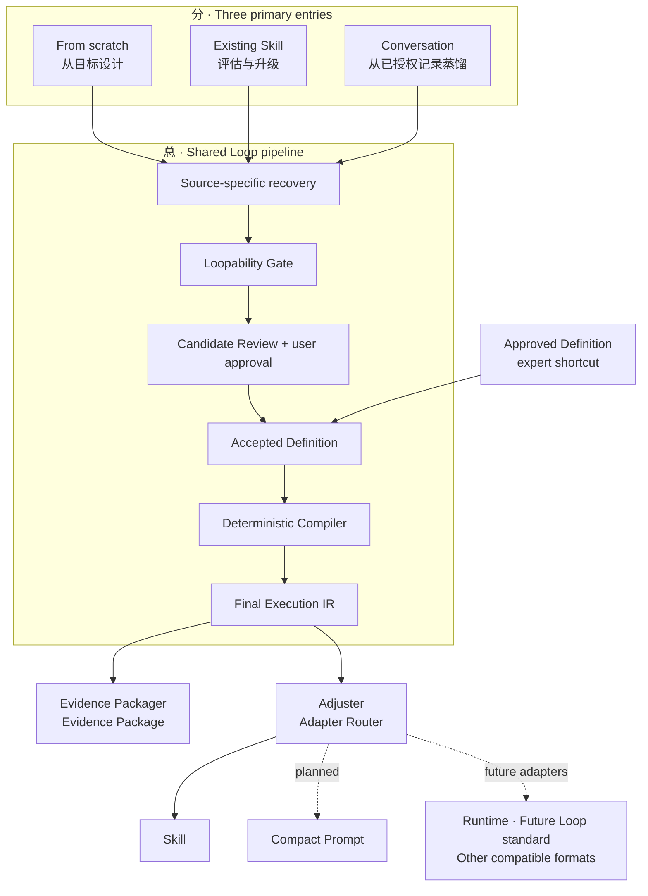

# Loop Craft README Information Architecture Refresh

> Date: 2026-07-31
> Status: Approved design; implementation not started

## 1. Goal

Rewrite `README.md` and `README.zh.md` so a first-time Agent user can understand what
Loop Craft does, choose the correct entry, install it, and invoke it without first learning
the internal IR, compiler, schema, or manifest model.

The README must restore the original product architecture:

```text
分：three primary discovery/design entries
→ 总：one shared Loop judgement, approval, and compilation pipeline
→ 分：Evidence Packager and Adjuster / Adapter Router
```

The README remains rigorous: implemented behavior, planned adapters, and future compatibility
directions must never be presented as the same status.

## 2. Audience and voice

The primary reader is an Agent user who wants to turn a goal, an existing Skill, or an
authorized work record into a reusable result. Maintainers and standards-oriented readers
are secondary audiences served through progressively disclosed engineering sections and
links to `docs/DESIGN.md`.

The voice is clear, credible, and forward-looking. Usage copy is friendly and immediately
actionable. Architecture, safety, evidence, and compatibility claims remain precise and
bounded.

## 3. Product position

### English hero

> **Turn real feedback cycles into Agent Loops that can observe, act, verify, adapt—and stop.**
>
> Loop Craft finds the Loop inside a goal, an existing Skill, or an authorized work record.
> It tests whether feedback can genuinely change the next action, shapes the result into one
> approved Loop Package, and sends that shared model to two independent outputs: an Evidence
> Package for traceability, and an Adjuster for delivery as a Skill or other compatible formats.
>
> If the work does not contain a real feedback loop, Loop Craft preserves it as an ordinary
> Workflow instead of manufacturing a fake Loop.

### Chinese hero

> **把真正的反馈闭环，变成 Agent 能观察、行动、验证、调整并及时停止的 Loop。**
>
> Loop Craft 从目标、既有 Skill 或已授权的工作记录中识别真正的 Loop。它先判断反馈是否
> 确实能够改变下一步行动，再形成一份经过确认的统一 Loop Package，并将同一个模型分向
> 两个独立出口：Evidence Package 负责可追溯性，Adjuster 负责将其交付为 Skill 或其他
> 兼容格式。
>
> 如果工作中不存在真正的反馈闭环，Loop Craft 会把它保留为普通 Workflow，而不是为了
> “有 Loop”强行制造循环。

## 4. Product architecture

The README's primary diagram is the product mental model, not the internal implementation
layer diagram.



### Meaning of the diagram

- From scratch, Existing Skill, and Conversation are the three primary discovery/design
  entries. They own source-specific recovery but converge on one shared Gate and Review.
- Direct Build is not a fourth discovery entry. It is an expert shortcut from an already
  approved Definition into the shared deterministic Core.
- The shared middle owns Loop judgement, user approval, validation, compilation, and the
  platform-neutral Final Execution IR.
- Evidence Packager and Adjuster are parallel consumers of the same Final Execution IR.
  Evidence is never an input to the Adjuster and never contaminates the runtime artifact.
- `Adjuster` is the user-facing name for the adaptation layer. `Adapter Router` is the
  corresponding engineering term in the approved architecture.
- The solid Skill edge expresses current behavior without a version label. Dotted edges and
  explicit labels distinguish planned or future adapters.
- Future Loop-standard support is a compatibility direction, not a current dependency,
  conformance claim, certification, or published standard implementation.

## 5. README information architecture

Both language editions use the same section order and factual boundaries:

1. Product position and language switch.
2. One-minute product model and primary architecture diagram.
3. Choose your starting point.
4. Quick start: install and invoke.
5. What you get: clean Artifact and separate Evidence Package.
6. How Loop Craft decides: seven-check Gate and 0/1/multi-Loop outcomes.
7. Why the result is trustworthy: approval, source preservation, deterministic build, and
   read-only verification.
8. Works today and evolution paths.
9. Developer entry: build commands, output shape, repository map, and deeper design links.
10. Reference boundaries, independence, and license.

The current implementation-layer diagram belongs in `docs/DESIGN.md`; it must not compete
with the product mental model at the top of the README.

## 6. Friendly entry and usage design

The entry selector is organized by what the user currently has:

| Starting material | Route | User-facing result |
|---|---|---|
| A goal or repeated problem | From scratch | Interview, Gate, and 0/1/multi-Loop decision |
| An existing Skill | Existing Skill | Read-only assessment before any approved upgrade |
| An authorized conversation or work record | Conversation | Recovered workflow and Loop decision |
| An approved Definition | Direct Build | Expert shortcut into deterministic Core |

Quick start documents only installation paths that can be stated truthfully from the current
repository:

1. Ask Codex `$skill-installer` to install the repository's `loop-craft/` directory.
2. Copy `loop-craft/` manually into an active Skill directory and run the platform validator.

It then provides four copy-ready natural-language invocation examples. JSON is never a
prerequisite for the first three routes.

## 7. Capability status model

`Works today` contains only implemented and validated behavior:

- three primary entries and the Direct Build expert shortcut;
- zero-Loop Workflow and single-Loop Skill packaging;
- clean Skill Artifact and separate Evidence Package;
- common existing-Skill source-package preservation;
- deterministic build and read-only drift verification.

`Evolution paths` contains capabilities that must not be implied as implemented:

- Compact Prompt adapter;
- Runtime adapter;
- future Loop-standard and other compatible format adapters;
- additional packaging, publication, and catalog paths.

Multi-Loop build, Runtime, Override, Subloop, publication, scheduling, and installation
automation remain outside the current product claim. The README may explain the intended
adapter architecture without moving these items into `Works today`.

## 8. Bilingual writing rules

- Keep headings, diagrams, links, status, and capability boundaries structurally equivalent.
- Do not force sentence-level literal translation. Chinese may explain a concept more
  explicitly; English may use tighter product-documentation phrasing.
- Use one stable term for each product concept: Loop Package, Evidence Package, Adjuster,
  Adapter Router, Workflow, Skill, and Direct Build.
- Explain a new technical term in plain language on first use.
- Keep copy-ready examples idiomatic in each language rather than translating word order.

## 9. Scope and verification

Implementation changes only:

- `README.md`
- `README.zh.md`
- `dashboard/status.json` as a support-layer status projection

The implementation must not change `loop-craft/`, schemas, compiler behavior, product
version, release status, or the approved normative architecture.

Verification is proportional to a documentation-only change:

- parse Mermaid fences and confirm both diagrams contain the same nodes and edge statuses;
- validate every local Markdown link in both README files;
- compare heading order and capability-status claims across languages;
- scan for stale claims that Compact Prompt, Runtime, or future-standard compatibility are
  already implemented;
- run `git diff --check` and validate `dashboard/status.json` as JSON.

No code test suite is required because no runtime contract changes.

## 10. Non-goals

- Redesigning `docs/DESIGN.md` or changing its normative ownership.
- Implementing Compact Prompt, Runtime, or a future-standard adapter.
- Renaming internal Python modules from adapter to adjuster.
- Creating a new industry Loop Package file format.
- Re-running behavioral experiments or the full pytest suite.
